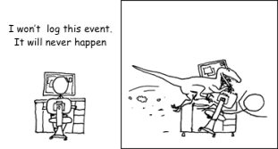

[Lagerpeton](https://en.wikipedia.org/wiki/Lagerpeton) is an ancient ornithodira lived ~236–234 million years ago. Any reference to class [Lager](https://docs.oracle.com/javase/7/docs/api/java/util/logging/Logger.html) and to language [Peton](https://www.python.org/) is purely coincidental

[]

## What the library for

Lagerpeton allows accumulation of context for logging.

Example:
```kotlin
// In App class
val globalLogger = Lager.android {
    it.put("appVersion", "1.0.0")
    it.put("platform", "Android")
}

class SomeViewModel {

    // In class
    val classLogger = globalLogger.new(
        owner = "SomeViewModel",
        // always will get current value 
        // because lambda evaluates on each logging
        onEachLog = {
            it.put("state", someState)
        }
    ) {
        // put static context. Will not be evaluated on each logging
        it.put("param", param)
    }

    fun eventHappened(arg1: String, arg2: String) {
        // On logging
        // If "info" logging level is disabled 
        // the lambda below will NOT be evaluated
        // just as onEachLog of [classLogger] and [globalLogger]
        classLogger.info("something happened") {
            it.put("arg1", arg1)
            it.put("arg2", arg2)
        }
    }
}
```

## Dependency

```kotlin
// in root build.gradle
allprojects {
    repositories {
        // ...
        maven { url = uri("https://dl.bintray.com/summermpp/summer") }
    }
}

// in module build.gradle
dependencies {
    implementation("io.adev:lagerpeton:0.1.7")
    
    // for android projects
    implementation("io.adev:lagerpeton-android:0.1.7")
}
```

Such title for [Lager](https://github.com/adevone/lagerpeton/blob/master/kmp-logger/src/commonMain/kotlin/io/adev/logger/Lager.kt) was chosen to not clash with another loggers like [java.util.logging.Logger](https://docs.oracle.com/javase/7/docs/api/java/util/logging/Logger.html). You can change it in your project if you need it:
```
typealias Logger = Lager
```